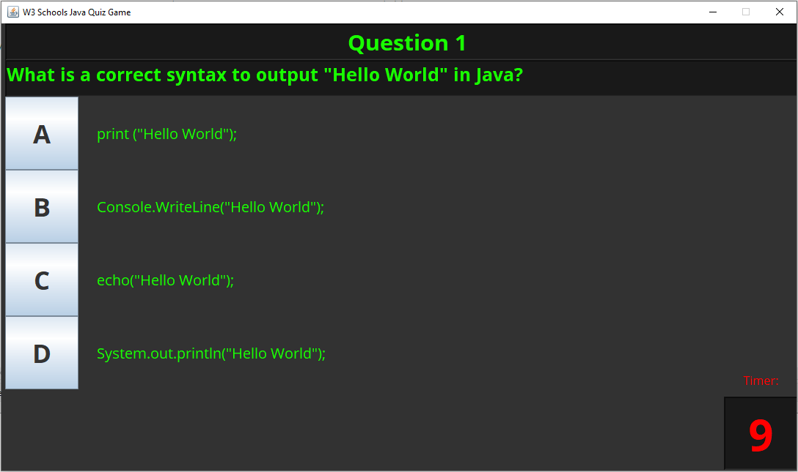
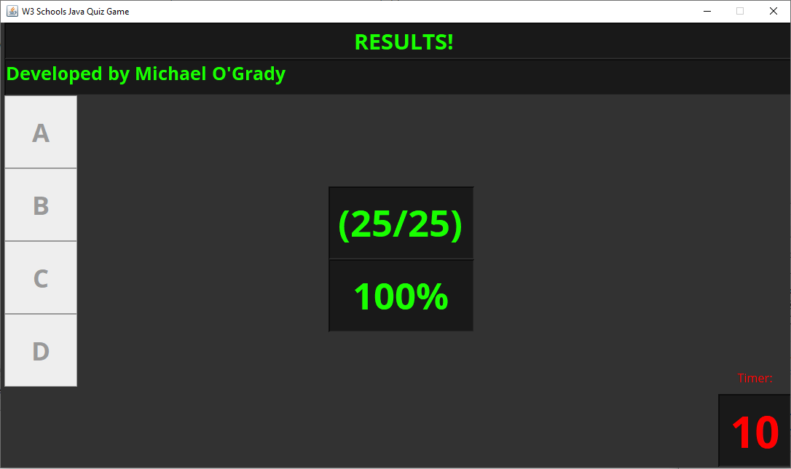

</a>

# Java Quiz Desktop Application

# Table of Contents

- [Java Quiz Desktop Application](#java-quiz-desktop-application)
- [Table of Contents](#table-of-contents)
- [Screenshots of the Application](#screenshots-of-the-application)
- [Description](#description)
- [System requirements](#system-requirements)
- [Source Code](#source-code)
- [Running the application as an executable](#running-the-application-as-an-executable)
- [Origonal Screenshot of the W3 Schools Java Quiz](#origonal-screenshot-of-the-w3-schools-java-quiz)

---

# Screenshots of the Application

 

 

# Description

A simple and quickly created GUI Java quiz application which uses 2D String array as a data structure to hold the question options, with String and char 2D arrays to hold questions and answers. The quiz questions were taken from the [Java Quiz on W3 Schools](https://www.w3schools.com/quiztest/quiztest.asp?qtest=JAVA).
The application is wrapped as an executable application (.exe) using Launch4j and ready to go.

# System requirements

- JavaSE-1.8 or higher.

# Source Code

The project was developed in Eclipse IDE and all source code and projects are uploaded as an Eclipse project for convenience.

- Source code is available to view in the src folder
- Compiled code located in the bin directory.
- Jar File
- Executable (.exe) File
- Doc's file (javadocs)

# Running the application as an executable

As the project has already been compiled into an executable file, all you need to is:

- download the project and run JavaQuiz.exe
- all other files are not required unless you wish to inspect the source code.

# Origonal Screenshot of the W3 Schools Java Quiz

 

