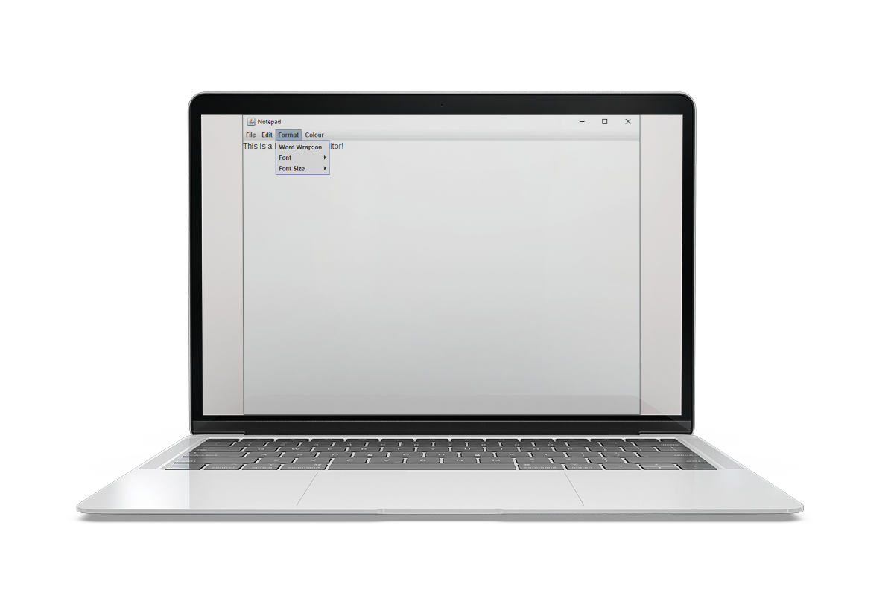
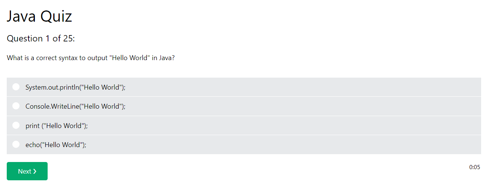

</a>

# Java Quiz Desktop Application

 

# Table of Contents

- [Java Quiz Desktop Application](#java-quiz-desktop-application)
- [Table of Contents](#table-of-contents)
- [Screenshots of the Application](#screenshots-of-the-application)
- [Description](#description)
- [System requirements](#system-requirements)
- [Packages used](#packages-used)
- [Source Code](#source-code)
- [Running the application as an executable](#running-the-application-as-an-executable)
- [Origonal Screenshot of the W3 Schools Java Quiz](#origonal-screenshot-of-the-w3-schools-java-quiz)

---

# Screenshots of the Application

 

 

# Description

A simple and quickly created GUI Java quiz application which uses 2D array data structure to hold the question options, with String and char arrays to hold questions and answers. Quiz questions are taken from the [Java Quiz on W3 Schools](https://www.w3schools.com/quiztest/quiztest.asp?qtest=JAVA).
Application is wrapped as an executable application (.exe) using Launch4j and ready to go.

# System requirements

- JavaSE-1.8 or higher.

# Packages used

- java.awt.event
- java.awt
- javax.swing

# Source Code

This project was developed in Eclipse IDE and uploaded as an Eclipse project for convenience.

- Source code is available to view in the src folder
- Compiled code located in the bin directory.
- Jar File
- Executable (.exe) File
- Doc's file (javadocs)

# Running the application as an executable

As the project has already been compiled into an executable file, all you need to is:

- Download the project and run Java Quiz Desktop Application.exe
- All other files are not required unless you wish to inspect the source code and documentation.

# Origonal Screenshot of the W3 Schools Java Quiz

 

